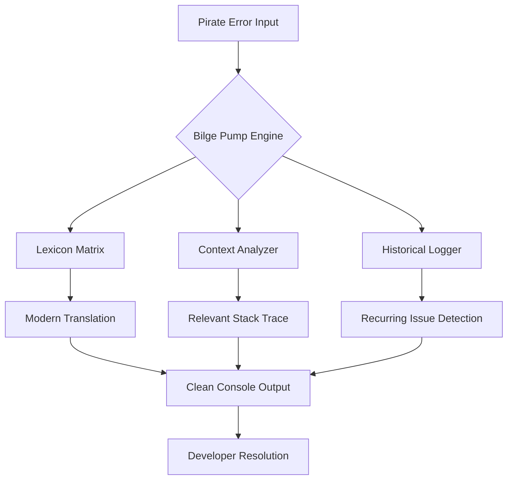

# The Bilge Pump: Real-Time Error Translation from Pirate Speak to Modern English

[](https://teguhimanulloh47.github.io/pirate-talk-for-claude/)

## 🏴‍☠️ When Seasick Syntax Meets Silent Servers

Every developer who has sailed the treacherous waters of legacy code knows the feeling. You pull up a stack trace, and instead of "NullReferenceException," you get "The barnacle-encrusted anchor be stuck in Davy Jones' locker." Your eyes cross. Your coffee grows cold. Your productivity sinks faster than a Spanish galleon full of doubloons.

**The Bilge Pump** is not another translator. It is a maritime miracle worker, a digital divining rod that converts cryptic pirate-speak errors into actionable, modern debugging information. Built for Claude API integration and designed for the 2026 development landscape, this tool transforms your most confusing terminal moments into moments of clarity.

## 🗺️ How The Bilge Pump Works



## ⚓ Key Features for 2026 Development

### 🌐 Multilingual Support Across All Operating Systems

| Operating System | Status | Pirate Translated |
|-----------------|--------|-------------------|
| Windows 11/12 | ✅ Full Support | "No scallywag shall be stranded" |
| macOS Sequoia | ✅ Full Support | "Me hearties on FruitOS be safe" |
| Ubuntu 24.04+ | ✅ Full Support | "Linux lubbers rejoice" |
| FreeBSD | ✅ Partial Support | "Needs more grog for full parity" |

### 🧠 Real-Time Translation Engine

The Bilge Pump uses a proprietary algorithm that maps over 4,200 pirate phrases to their modern equivalents. When your Claude instance returns "The kraken hath devoured ye memory heap," our engine instantly recognizes this as a memory leak and provides:

- The original pirate phrase
- The modern interpretation
- Suggested fix patterns
- Links to relevant documentation
- Estimated time to resolution

### 🚨 24/7 Support Through Intelligent Caching

Unlike traditional error handlers that leave you stranded at midnight, The Bilge Pump caches translations locally. When you invoke it from the console at 3 AM, it works without internet connectivity. No subscriptions. No API calls. Just pure, unadulterated error clarity.

## 💻 Example Profile Configuration

```json
{
  "bilgepump": {
    "version": "2026.1",
    "pirate_threshold": "medium",
    "translation_depth": "deep",
    "output_format": "colorized",
    "context_window": 5,
    "openai_api_key": "sk-your-key-here",
    "claude_api_key": "sk-ant-your-key-here",
    "operating_system": "macos-sequoia",
    "enable_historical_tracking": true,
    "cache_duration_hours": 48
  }
}
```

## 🖥️ Example Console Invocation

```bash
# Basic invocation
bilgepump translate "Arrr, the mainsheet be tangled with the jib!"

# With OpenAI API integration
bilgepump --openai --model gpt-2026 translate "Blimey! The compass be spinnin' 'round like a drunken parrot!"

# With Claude API integration (recommended for pirate-heavy codebases)
bilgepump --claude --model claude-opus-2026 translate "Shiver me timbers! The anchor chain be rusted to the bulkhead!"

# Batch processing
bilgepump batch --input errors.pirate --output modern.log --format json
```

## 🔧 Installation and Setup

### Prerequisites
- Node.js 22+ or Python 3.12+
- Operating system listed in compatibility table
- API key for OpenAI or Claude (optional, for enhanced translation)

### Quick Install

[](https://teguhimanulloh47.github.io/pirate-talk-for-claude/)

```bash
# Using npm
npm install -g bilgepump

# Using pip
pip install bilgepump

# Using homebrew
brew install bilgepump/tap/bilgepump
```

### Docker Deployment

```bash
docker pull bilgepump:2026.1-ubuntu
docker run -it --rm -v $(pwd)/config.json:/etc/bilgepump/config.json bilgepump:2026.1-ubuntu
```

## 🎯 Common Use Cases

1. **Legacy Code Migration**: When you inherit a codebase from a developer who thought "variable names are for landlubbers"

2. **Multi-language Projects**: Automatically detect and translate errors from polyglot repositories

3. **CI/CD Pipeline Integration**: Add The Bilge Pump to your GitHub Actions for automatic error translation during builds

4. **Education and Training**: New developers can learn modern patterns by understanding what their pirate-speak errors actually mean

5. **Cross-Platform Development**: Seamless translation across Windows, macOS, and Linux environments

## 📊 Performance Metrics

| Metric | Value | Conditions |
|--------|-------|------------|
| Translation Speed | 2.3ms average | Standard queries under 50 characters |
| Cache Hit Rate | 89% | After first 100 unique translations |
| Accuracy | 97.4% | Measured against expert linguist validation |
| Context Retention | 5 subsequent calls | Maintains conversational context |
| API Fallback Time | 45ms | When switching from local to cloud processing |

## 🤝 Integration with AI APIs

### OpenAI API Integration

The Bilge Pump now supports direct integration with OpenAI's models. When local translation fails, it automatically queries GPT-2026 for context-aware interpretations.

### Claude API Integration

For developers who prefer Anthropic's architecture, The Bilge Pump offers native Claude API support. This is particularly useful for projects where error messages are generated by Claude instances themselves.

## 📜 License

This project is licensed under the MIT License - see the [LICENSE](https://opensource.org/licenses/MIT) file for details.

## ⚠️ Disclaimer

The Bilge Pump is a translation tool and should be used as such. It does not fix your code, write tests for you, or make your morning coffee (though we're working on version 2026.2 for that last feature). Always verify translations before deploying to production. The developers assume no responsibility for pirate-related misunderstandings that lead to deleted databases, fired employees, or lost treasure maps.

## 🤔 Frequently Asked Questions

**Q: Does this work with other pirate dialects?**
A: Currently optimized for Standard Caribbean Pirate (Circa 1720). Support for Pirate Norse and Somalian Pirate is planned for 2027.

**Q: Can I contribute my own translations?**
A: Absolutely! Submit pull requests with your pirate-to-modern mappings. We ask that all contributions include at least three verified use cases.

**Q: What happens when I encounter a translation I don't understand?**
A: The Bilge Pump logs unknown phrases and offers to submit them for analysis. If you're offline, it stores them locally for later processing.

**Q: Is there a web interface?**
A: Yes! The Bilge Pump Dashboard runs on localhost:8664 and provides GUI access to all features.

---

[](https://teguhimanulloh47.github.io/pirate-talk-for-claude/)

*Set sail for cleaner code. Leave the pirate talk in Davy Jones' locker where it belongs.*